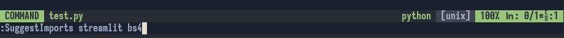
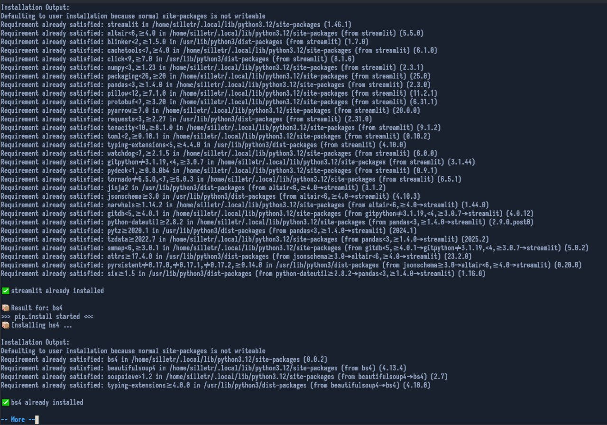

# LazyDevHelper

---

## Warning

Still Cooking... 🍳  
Right now, the plugin can only **check for libraries and install** via `pip list` & `pip install`...  
Adding support for `requirements.txt` coming soon.

---
<h1>Introduction</h1>

*Have you ever been in a situation like:*

> "I added 5 libs into my code before installing them, and now I need to write code with them... but I don't wanna switch to the console and write command. fucking world and terminal."

If yes — **Congratulations!** 🎉  
**You've found the Neovim plugin that can help you with both coding and installing Python libraries.**
---
# Errors
Error status: 
<pre>
  26/06/2025 - <b>ISSUE 7 - CLOSED</b>
    Cause - i fixed this error and now plugin doing main functional (installing library to pip)
</pre>    
If u have any suggest - or send comment to issue, or send push request, <b>i`ll check it and add to main branch if your variant working
---

# Installation Requirements
- Neovim 0.9+
- Python 3.10+
---
# Usage
Input:  

  
Output example:

---
# Status of plugin
<h3>Status of 06/26/2025:</h3>
<b>This plugin is still in development. It's being built by a Python developer (me), who's learning Lua and Neovim's API to provide the best possible user experience.</b>

<h3>Status of: 01/07/2025</h3>
Plugin still in development, and i think how i can add libraries to requiremenents file, <b>if u have any ideas see below</b>:

If you spot any errors or want to help — feel free to create a Issua and Push Request.  
If it works (I will test it), I’ll definitely consider adding your version to the project!

